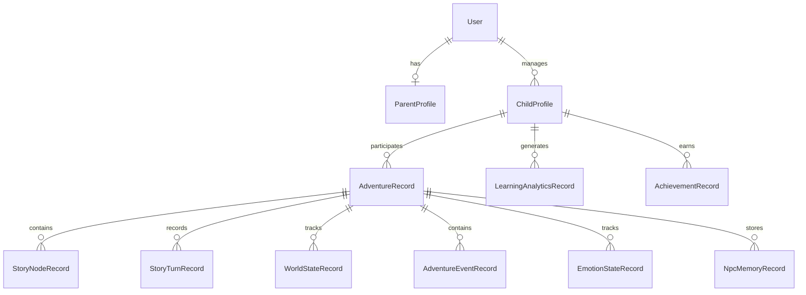

# StoryForgeAI — Adaptive AI Storytelling & Learning Platform

**Turn interactive storytelling into a personalized learning experience where every choice shapes the story, adapts to the learner, and generates meaningful learning insights.**

[](https://nodejs.org/)
[](https://react.dev/)
[](https://www.postgresql.org/)
[](https://ai.google.dev/)

---

## Table of Contents

1. [Problem Statement](#problem-statement)
2. [Our Solution](#our-solution)
3. [System Architecture](#system-architecture)
4. [AI + Story Adaptation Pipeline](#ai--story-adaptation-pipeline)
5. [Tech Stack](#tech-stack)
6. [Project Structure](#project-structure)
7. [Database Schema](#database-schema)
8. [Features](#features)
9. [API Reference](#api-reference)
10. [Getting Started](#getting-started)
11. [Environment Variables](#environment-variables)

---

## Problem Statement

Traditional educational content is often:

- **One-size-fits-all** — The same material is presented regardless of a learner's reading level or progress
- **Passive** — Learners consume content instead of actively making decisions
- **Disconnected from context** — Learning activities are separated from the experiences that motivate them
- **Difficult to personalize** — Adapting stories, difficulty, and learning goals manually does not scale

> **Result:** Learners can lose engagement while educators and parents have limited visibility into how learning happens during an experience.

---

## Our Solution

**StoryForgeAI** combines interactive storytelling, AI-driven adaptation, and learning analytics into a single platform:

| **Step** | **What Happens** |
| -------- | ---------------- |
| **Create** | Set up a learner profile with age, reading level, vocabulary level, and learning context |
| **Generate** | AI creates an interactive adventure around a selected premise, world, and learning direction |
| **Interact** | The learner reads the story and makes choices that influence the adventure |
| **Adapt** | Story progression, difficulty, narrative state, and learning signals evolve from the learner's interaction |
| **Reflect** | The system records meaningful signals from the experience and turns them into learning insights |
| **Review** | Parents can review progress, reports, and learner-facing analytics |

---

## System Architecture

```text
                         ┌──────────────────────────┐
                         │          Learner         │
                         │   Interactive Adventure  │
                         └────────────┬─────────────┘
                                      │
                                      ▼
                    ┌─────────────────────────────────┐
                    │       React + TypeScript UI     │
                    │        Vite + Tailwind CSS      │
                    └────────────────┬────────────────┘
                                     │
                                     ▼
                    ┌─────────────────────────────────┐
                    │       Node.js + Express API      │
                    │ Auth • Parents • Children        │
                    │ Adventures • Reports • Settings  │
                    └────────────────┬────────────────┘
                                     │
                    ┌────────────────┼────────────────┐
                    ▼                ▼                ▼
          ┌────────────────┐ ┌────────────────┐ ┌────────────────┐
          │ Story / Graph  │ │ Learning &     │ │ Simulation /   │
          │ Runtime        │ │ Analytics      │ │ Knowledge      │
          └───────┬────────┘ └───────┬────────┘ └───────┬────────┘
                  │                  │                  │
                  └──────────────────┼──────────────────┘
                                     ▼
                          ┌─────────────────────┐
                          │   LLM Provider      │
                          │ Gemini / Ollama      │
                          └──────────┬──────────┘
                                     │
                                     ▼
                          ┌─────────────────────┐
                          │ PostgreSQL + Prisma │
                          │  or In-Memory Mode  │
                          └─────────────────────┘
```

---

## AI + Story Adaptation Pipeline

### Step 1: Learner Context

The system uses the learner profile and adventure context to establish an appropriate starting point for the experience.

Relevant context can include:

- Age range
- Reading level
- Vocabulary level
- Adventure world
- Learning direction
- Current story state

### Step 2: Story Generation

The AI layer generates narrative content while maintaining the structured state of the adventure.

The story is represented as a graph of connected story nodes containing information such as:

- Narrative
- Choices
- Learning signals
- Difficulty
- Reading level
- Emotional state
- Story effects

### Step 3: Interactive Choice

The learner selects an available choice.

That choice updates the adventure state and determines the next part of the story rather than following a fixed linear sequence.

### Step 4: Adaptation

The system maintains structured world and learner state across turns.

This allows the experience to account for:

- Previous choices
- Current story position
- Character and relationship state
- Quests and events
- Learning signals
- Difficulty and reading-level context

### Step 5: Learning Insights

Interaction data is transformed into learning analytics and reports that can help surface patterns in learner progress and behaviour.

### Full Pipeline Flow

```text
Learner Profile
      │
      ▼
Adventure Context
      │
      ▼
AI Story Generation
      │
      ▼
Story Graph + World State
      │
      ▼
Learner Choice
      │
      ▼
State Update + Adaptation
      │
      ▼
Learning Signals
      │
      ▼
Analytics + Reports
```

---

## Tech Stack

### Backend

| **Technology** | **Purpose** |
| -------------- | ----------- |
| **Node.js** | JavaScript runtime |
| **Express** | REST API framework |
| **TypeScript** | Type-safe backend development |
| **Prisma** | Database ORM |
| **PostgreSQL** | Persistent relational storage |
| **JWT** | Authentication and session tokens |
| **bcrypt** | Password hashing |
| **Gemini API** | AI-powered story and learning generation |
| **Ollama** | Optional local LLM / embedding provider |

### Frontend

| **Technology** | **Purpose** |
| -------------- | ----------- |
| **React 18** | UI framework |
| **Vite** | Build tool and development server |
| **TypeScript** | Type-safe frontend development |
| **Tailwind CSS** | UI styling |
| **React Router** | Client-side routing |
| **Framer Motion** | UI animations |
| **Browser Speech Synthesis** | Story narration |

---

## Project Structure

```text
StoryForgeAI/
├── apps/
│
├── packages/
│   ├── api/                  # Express API and application entry point
│   ├── ui/                   # React frontend
│   ├── database/             # Prisma schema and database layer
│   ├── identity/             # Authentication and identity
│   ├── parent/               # Parent-facing functionality
│   ├── child/                # Learner-facing functionality
│   ├── learning/             # Learning signals and analytics
│   ├── story-agent/          # Story generation
│   ├── story-graph/          # Graph-based story representation
│   ├── simulation-engine/    # World and simulation state
│   ├── knowledge-engine/     # Knowledge retrieval and context
│   ├── workflow-engine/      # AI workflow orchestration
│   ├── planner-agent/        # Planning
│   ├── requirement-agent/    # Requirement handling
│   ├── research-agent/       # Research/context generation
│   ├── critic-agent/         # Story/content evaluation
│   ├── reflection-agent/     # Reflection
│   ├── analytics-agent/      # Analytics processing
│   ├── prompt-manager/       # Prompt management
│   ├── llm-client/           # LLM provider abstraction
│   ├── provider/             # Provider interfaces
│   ├── agent-sdk/            # Shared agent infrastructure
│   ├── shared/               # Shared types and utilities
│   └── ...
│
├── services/
├── pnpm-workspace.yaml
├── package.json
└── tsconfig.base.json
```

---

## Database Schema

The application uses **PostgreSQL with Prisma** for persistent storage, with an in-memory mode available for lightweight development and trials.

The data model covers users, learner profiles, adventures, story nodes, world state, story turns, learning analytics, events, emotional state, NPC memory, and achievements.



---

## Features

### Interactive Storytelling

- **AI-Generated Adventures** — Create dynamic stories from structured adventure context
- **Choice-Driven Narrative** — Learner decisions determine story progression
- **Story Graph** — Adventures are represented as connected narrative states rather than a single linear script
- **Persistent World State** — Story context, relationships, quests, inventory, and other state can evolve across turns
- **Narration** — Browser-based speech synthesis for story playback

### Personalization

- **Learner Profiles** — Store age range, reading level, vocabulary level, and learner context
- **Adaptive Difficulty** — Story nodes can carry difficulty and reading-level information
- **Context-Aware Generation** — AI generation uses learner and adventure state
- **Parent Dashboard** — Parent-facing views for learner information and reports

### Learning & Analytics

- **Learning Signals** — Capture learning-relevant information during story interactions
- **Behavioural Context** — Maintain structured observations from the learner's experience
- **Learning Analytics** — Aggregate signals into learner-level insights
- **Reports** — Provide parent-facing summaries of learning progress and activity
- **Achievements** — Track meaningful milestones within the experience

### Platform

- **Authentication** — JWT-based user authentication
- **BYOK Support** — Users can provide their own Gemini API key
- **Provider Abstraction** — Supports Gemini and optional local Ollama configuration
- **Persistent / In-Memory Modes** — PostgreSQL persistence or lightweight memory mode
- **Demo Adventures** — Built-in demo flows for exploring the platform

---

## API Reference

The backend exposes REST API route groups for the main application capabilities.

### Health

| **Method** | **Endpoint** | **Description** |
| ---------- | ------------ | --------------- |
| `GET` | `/health` | Check API service status |

### Authentication

| **Route Group** | **Purpose** |
| --------------- | ----------- |
| `/api/auth` | Registration, login, session, and authentication operations |

### Parents & Learners

| **Route Group** | **Purpose** |
| --------------- | ----------- |
| `/api/parents` | Parent profile and parent-facing operations |
| `/api/children` | Learner profile and child-related operations |

### Adventures

| **Route Group** | **Purpose** |
| --------------- | ----------- |
| `/api/adventures` | Adventure creation, story progression, and interactive adventure operations |

### Reports & Settings

| **Route Group** | **Purpose** |
| --------------- | ----------- |
| `/api/reports` | Learning and progress reports |
| `/api/settings` | Application and user settings |
| `/api/demo` | Demo and example adventure flows |

---

## Getting Started

### Prerequisites

- **Node.js**
- **pnpm 11**
- **PostgreSQL** (optional when using in-memory persistence)
- **Gemini API key** (or an Ollama setup for local use)

### 1. Clone the Repository

```bash
git clone https://github.com/GaliAkshatha/StoryForgeAI.git
cd StoryForgeAI
```

### 2. Install Dependencies

```bash
pnpm install
```

### 3. Configure the Backend

Create `packages/api/.env`:

```env
PORT=4000
JWT_SECRET=your_jwt_secret

LLM_PROVIDER=gemini
GEMINI_API_KEY=your_gemini_api_key
GEMINI_MODEL=gemini-2.5-flash

PERSISTENCE=memory
```

For PostgreSQL persistence:

```env
PERSISTENCE=postgres
DATABASE_URL=your_postgresql_connection_string
```

### 4. Configure the Frontend

Create `packages/ui/.env`:

```env
VITE_API_BASE_URL=http://localhost:4000/api
```

### 5. Run the Application

```bash
pnpm dev
```

The frontend and backend development servers will start through the workspace configuration.

---

## Environment Variables

### Backend (`packages/api/.env`)

| **Variable** | **Default** | **Description** |
| ------------ | ----------- | --------------- |
| `PORT` | `4000` | Backend server port |
| `JWT_SECRET` | — | Secret used for JWT signing |
| `JWT_TTL_SECONDS` | — | Optional JWT lifetime |
| `LLM_PROVIDER` | `gemini` | LLM provider (`gemini` or `ollama`) |
| `GEMINI_API_KEY` | — | Gemini API key |
| `GEMINI_MODEL` | — | Gemini model name |
| `OLLAMA_BASE_URL` | — | Ollama server URL for local usage |
| `OLLAMA_MODEL` | — | Ollama model name |
| `OLLAMA_EMBEDDING_MODEL` | — | Embedding model for local retrieval |
| `PERSISTENCE` | `memory` | Persistence mode (`memory` or `postgres`) |
| `DATABASE_URL` | — | PostgreSQL connection string |
| `ENCRYPTION_KEY` | — | Key used for encrypted stored provider credentials |

### Frontend (`packages/ui/.env`)

| **Variable** | **Default** | **Description** |
| ------------ | ----------- | --------------- |
| `VITE_API_BASE_URL` | `http://localhost:4000/api` | Backend API base URL |

---

## Deployment

**Live Application:** https://storyforgeai.akshathag.in/

**Backend API:** https://storyforgeai-1.onrender.com/

---

Built by [Akshatha Gali](https://github.com/GaliAkshatha)
